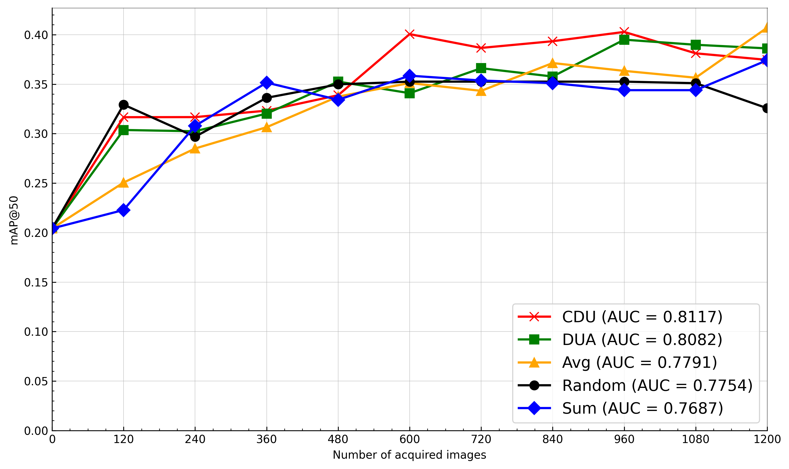
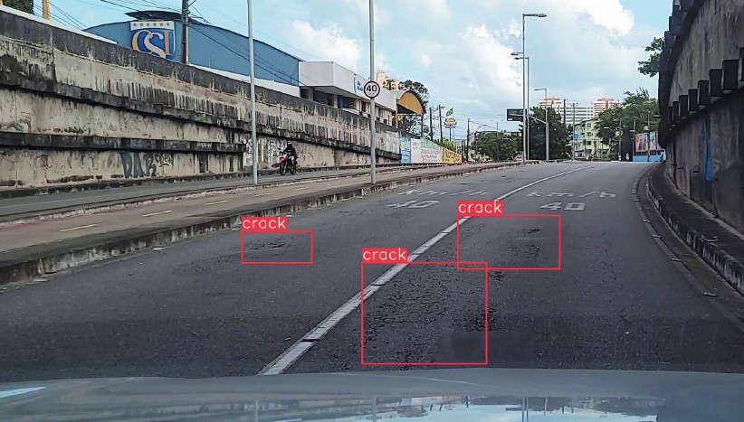
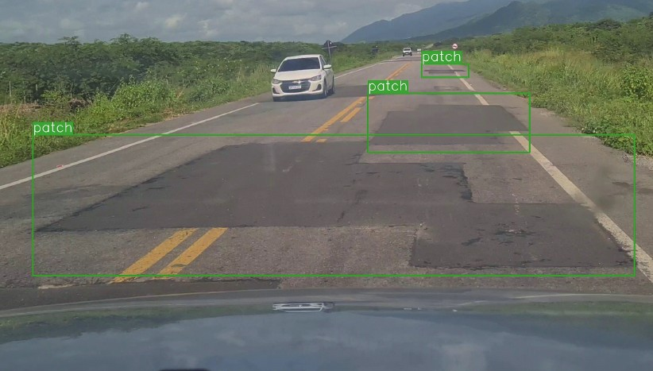
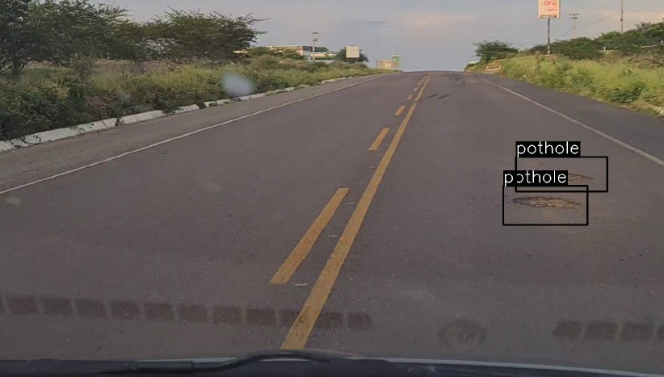
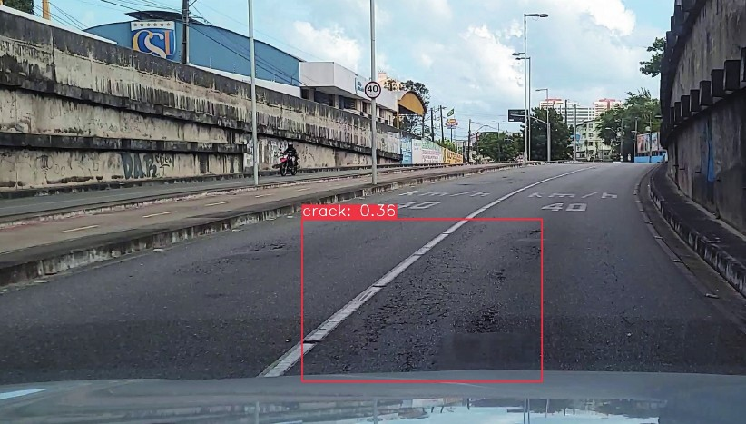
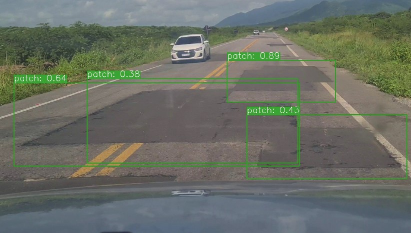
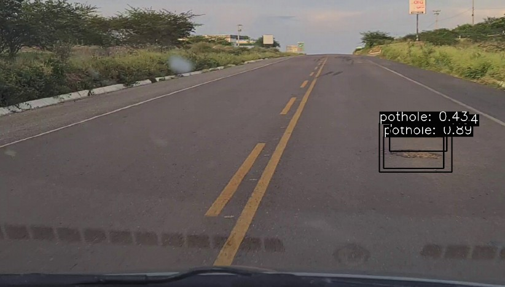
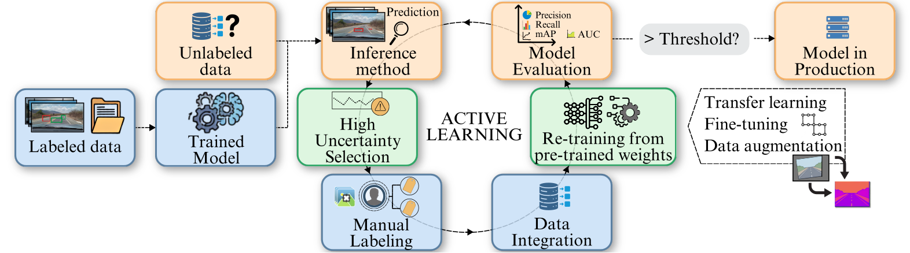
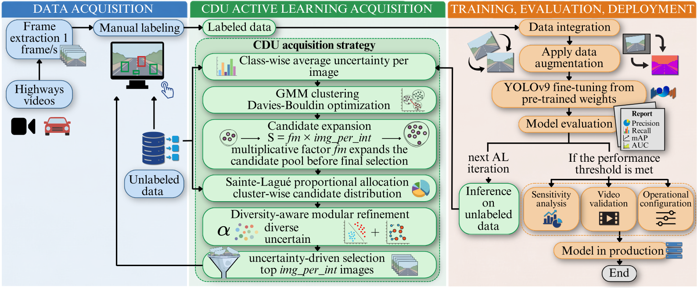

# CDU: active learning for pavement-defect detection

A large image collection does not guarantee a reliable detector when only a
small subset is labeled. Pavement inspection requires expert annotation, is
time-consuming, and tends to preserve the imbalance between frequent defects
and visually difficult classes such as `crack`. Active learning reduces this
cost by selecting which images from the unlabeled pool should be annotated in
each round.

CDU (*Clustering in Diversity and Uncertainty*) retains class-wise uncertainty,
organizes the pool with Gaussian mixture models, distributes candidates among
groups with Sainte-Laguë allocation, and refines the selection using
uncertainty and diversity. The benchmark compares CDU with
[Random](active_learning_benchmark/strategies/random.py),
[Sum](active_learning_benchmark/strategies/sum.py),
[Avg](active_learning_benchmark/strategies/avg.py), and
[DUA](active_learning_benchmark/strategies/dua.py), introduced in
[Active Learning for Single-Stage Object Detection in UAV Images](https://openaccess.thecvf.com/content/WACV2024/html/Yamani_Active_Learning_for_Single-Stage_Object_Detection_in_UAV_Images_WACV_2024_paper.html),
under the same image budget. The nine ablations and five CDU stages are
separated and documented in [cdu.py](active_learning_benchmark/strategies/cdu.py).



CDU achieved the highest normalized area under the learning curve (0.812).
The AUC integrates every available round; only the displayed curves are sampled
every six rounds to remain legible.

## Pavement-defect examples

The first row below shows reference annotations, and the second row shows CDU
detections at a confidence threshold of 0.35. The examples illustrate the
differences in scale and shape among `crack`, `patch`, and `pothole`, including
cases in which a region represented by several reference boxes is recovered by
a broader prediction.

| Reference | *crack* | *patch* | *pothole* |
|---|---|---|---|
| Labeled |  |  |  |
| Predicted by CDU |  |  |  |

*Reference annotations and CDU predictions for the three classes.*

## Method overview

The active-learning cycle starts with a small labeled set. A detector is trained
on these images and estimates the relevance of samples in the pool. The
acquisition strategy selects a new batch, an expert supplies its annotations,
and the labeled training set is expanded for the next round.

<p align="center">
  
</p>
<p align="center"><em>General active-learning cycle for pavement-defect detection.</em></p>

CDU preserves the uncertainty response of each class, groups these profiles
with a GMM, sizes the candidate set with a multiplication factor, allocates
group quotas with Sainte-Laguë, and combines uncertainty with diversity before
the final acquisition. The new annotations return to the labeled set, and the
detector is evaluated under the same protocol.

<p align="center">
  
</p>
<p align="center"><em>CDU workflow from data preparation to acquisition, integration, and evaluation.</em></p>

Vector versions of both diagrams are available in
[`figures/methodology/`](figures/methodology/).

## Experimental design

The dataset contains 4,277 images extracted from 48 highway videos. The 670
annotated images are divided into 252 for initial training, 200 for validation,
and 218 for testing. The acquisition pool contains 3,607 images. Frames from a
single road sequence remain in the same split, while validation and test images
never participate in acquisition. This sequence-aware temporal allocation is
performed before the benchmark; the code receives the four predefined
manifests and verifies that neither an image nor its source sequence occurs in
more than one split.

Each strategy runs 60 rounds of 20 images, for the same acquisition budget of
1,200 images and a final training set of 1,452 images. In every round, YOLOv9e
is reinitialized from the same pretrained weights and trained on the updated
labeled set. The detector from one round scores the pool for the next
acquisition, but its learned weights do not initialize the next training run.
This separates the effect of acquisition from cumulative fine-tuning.

The two checkpoints used by the study are in `weights/`:

- [yolov9e.pt](weights/yolov9e.pt) initializes every training run;
- [cdu_final.pt](weights/cdu_final.pt) is the final CDU model used for the
  sensitivity analysis.

Their expected hashes are stored in [config.json](config.json) and checked
before execution. Because each checkpoint exceeds the usual Git file limit,
both are tracked with Git LFS through [.gitattributes](.gitattributes).

## Reading the benchmark

This `README.md` introduces the problem, protocol, and entry points. Continue
with [REPRODUCTION.md](REPRODUCTION.md), which connects the reference
strategies, the nine ablations, and the analyses following the acquisition
cycle.

Three notebooks provide the scientific reading of the method and results:

1. [cdu_3d_visualization.ipynb](notebooks/cdu_3d_visualization.ipynb)
   reconstructs the four panels for round 36: the DUA reference, GMM groups,
   80 candidates, and 20 CDU acquisitions. Three-dimensional visualization is
   possible because the study has three classes; each axis represents the
   uncertainty response for `crack`, `patch`, or `pothole`;
2. [active_learning.ipynb](notebooks/active_learning.ipynb) reconstructs the
   image- and object-based learning curves, test comparison, DUA/CDU class
   plots, nine-variant table, and `crack` AUC curve;
3. [sensitivity_analysis.ipynb](notebooks/sensitivity_analysis.ipynb)
   reconstructs the class- and IoU-specific curves, `crack` threshold analysis,
   F1-based operating points, and IoU-confidence heatmaps.

The production figures are generated during benchmark execution and can also
be regenerated from the recorded results through these notebooks.

## Published data and figures

The benchmark has two consolidated CSV files:

- `run_model/results/active_learning_results.csv`: baseline, reference
  strategies, nine CDU variants, and class-wise validation/test metrics by
  round;
- `run_model/results/sensitivity_results.csv`: final-CDU results across the
  IoU-confidence space.

| Sensitivity dimension | Values | Purpose |
|---|---|---|
| NMS IoU | 0.50, 0.60, 0.70, 0.80 | effect of suppressing redundant predicted boxes |
| confidence | 0.01 to 0.81 in steps of 0.01 | trade-off between false positives and recovery |
| class | `crack`, `patch`, `pothole` | operating threshold for each defect difficulty |

Quantitative PDFs and PNGs are stored in `figures/paper/`. Visual examples,
method diagrams, and conceptual sensitivity images are stored in
`figures/examples/`, `figures/methodology/`, and `figures/sensitivity/`,
respectively. The four explanatory 3D visualizations are kept separately in
`figures/clustering/` and displayed by
`notebooks/cdu_3d_visualization.ipynb`. The file
`notebooks/data/uncertainty_profiles.pkl` stores the class-wise uncertainty
profiles used by this visualization. Groups, quotas, candidates, and
acquisitions are recomputed by the final CDU strategy functions. Each panel is
also exported as an interactive HTML file. Once a new final-CDU run reaches
round 36, the visualization uses the profiles and decisions recorded by that
run.

The public package includes `train.txt`, `valid.txt`, `test.txt`, and
`pool.txt`, which preserve the experimental splits and image identifiers. The
images and labels are not distributed through Git because of institutional
sharing restrictions; access can be requested at
[paulinavelasquez@alu.ufc.br](mailto:paulinavelasquez@alu.ufc.br). After
authorization, the files are installed locally in the layout expected by the
manifests. Each strategy creates a new training manifest containing the
acquired images without duplicating physical files.

## Environment

Install Git LFS before cloning so that both checkpoints are downloaded with
the repository:

```bash
git lfs install
git clone https://github.com/paulinavelasquez/cdu.git
cd cdu
git lfs pull
```

The benchmark pins the YOLOv9e checkpoint and the core versions used for the
experiments: Python 3.10, PyTorch 2.4.1 with CUDA 12.1, and
[Ultralytics 8.2.28](https://github.com/ultralytics/ultralytics/releases/tag/v8.2.28).
This 2024 Ultralytics release is retained with the checkpoint hashes because
later revisions can change model loading, training, or post-processing. The
complete verified environment, including transitive dependencies, is pinned in
`requirements.txt`:

```bash
python3.10 -m venv .venv
source .venv/bin/activate
python -m pip install --upgrade pip
python -m pip install -r requirements.txt
python -m ipykernel install --user --name cdu-benchmark \
  --display-name "CDU benchmark"
python run.py check
```

## Execution

From the repository root, run the complete pipeline with:

```bash
python run.py
```

This single entry point runs active learning, updates the figures after every
method, and performs the final sensitivity analysis. An interrupted execution
resumes from its completed rounds.

To regenerate figures from the recorded results:

```bash
python run.py plots
```

## Repository structure

```text
repo/
├── active_learning_benchmark/
│   ├── active_learning.py           # training-evaluation-acquisition cycle
│   ├── strategies/                  # Random, Sum, Avg, DUA, and CDU
│   ├── cluster_visualization.py     # profiles, GMM, and CDU acquisition in 3D
│   ├── paper_plots.py               # active-learning and ablation figures
│   ├── sensitivity.py               # sensitivity-grid evaluation
│   └── sensitivity_visuals.py       # curves, heatmaps, and F1 selection
├── datasets/                         # manifests; local data available on request
├── weights/                          # YOLOv9e and final CDU checkpoints
├── notebooks/
│   ├── data/uncertainty_profiles.pkl # profiles used by the 3D visualization
│   └── *.ipynb                       # scientific interpretation of results
├── figures/
│   ├── examples/                     # annotations and predictions by class
│   ├── methodology/                  # AL cycle and CDU workflow
│   ├── clustering/                   # explanatory CDU 3D visualizations
│   ├── sensitivity/                  # IoU and metric concepts
│   └── paper/                        # quantitative paper figures
├── run_model/results/                # the two consolidated CSV files
├── config.json
├── requirements.txt
└── run.py
```
