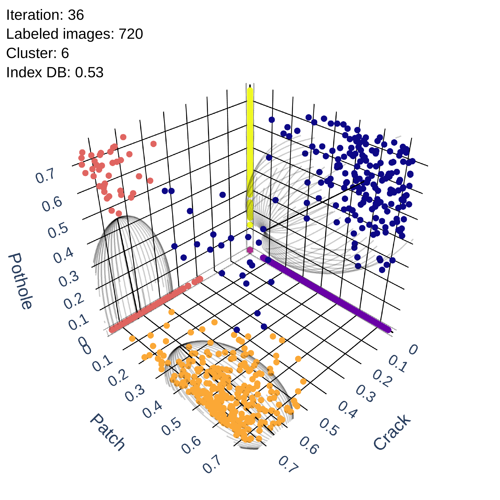

# Experimental protocol

The benchmark evaluates how acquisition rules use a fixed annotation budget to
train a detector for `crack`, `patch`, and `pothole`. Every strategy starts from
the same labeled split, uses the same YOLOv9e architecture, and is evaluated on
the same validation and test sets. The experimental variable is the sequence
of images acquired from the pool.

## Dataset and annotation budget

| Split | Manifest | Images | Objects | Role |
|---|---|---:|---:|---|
| initial training | `train.txt` | 252 | 435 | common starting point |
| validation | `valid.txt` | 200 | 306 | monitoring and sensitivity analysis |
| test | `test.txt` | 218 | 387 | final comparison |
| pool | `pool.txt` | 3,607 | 7,651 | active acquisition |

The data split is prepared before the benchmark. Identifiers keep each road
sequence in only one of the four manifests, preventing nearly identical road
segments from being mixed among training, validation, test, and pool. The code
does not recreate this allocation: it verifies the supplied splits and runs
acquisition on the pool. A strategy receives only detector predictions; the
label of an acquired image enters training after selection. Each method
acquires 20 images in each of 60 rounds. The acquisition axis therefore spans
0 to 1,200 new images, while the final comparison also includes the 252 initial
images.

## Reference strategies

- [**Random**](active_learning_benchmark/strategies/random.py) shuffles the
  available identifiers with a controlled seed and takes the first batch.
- [**Sum**](active_learning_benchmark/strategies/sum.py) sums
  `1 − confidence` over every detection in an image and can favor scenes with
  many objects.
- [**Avg**](active_learning_benchmark/strategies/avg.py) averages the same
  uncertainty and reduces the effect of box count.
- [**DUA**](active_learning_benchmark/strategies/dua.py) implements
  [Diverse Uncertainty Aggregation](https://openaccess.thecvf.com/content/WACV2024/html/Yamani_Active_Learning_for_Single-Stage_Object_Detection_in_UAV_Images_WACV_2024_paper.html):
  it averages uncertainty within each detected class and sums the class
  components, preserving their contribution before aggregation.

These references show when a scalar score concentrates the budget on dominant
classes or visually redundant scenes.

## Clustering in Diversity and Uncertainty

The implementation follows the paper algorithm in the same order, with one
identifiable function for each responsibility:

1. [`build_uncertainty_space`](active_learning_benchmark/strategies/cdu.py)
   builds the class-wise uncertainty profile. Each image is represented by
   `[U_crack, U_patch, U_pothole]`; an undetected class contributes zero, and
   the sum of the three components gives `U(i)`.
2. [`optimize_n_clusters`](active_learning_benchmark/strategies/cdu.py)
   fits the GMM and evaluates the Davies–Bouldin index. In adaptive variants,
   `G` ranges from `K` to `5K`, and the partition with the lowest DB index
   organizes images with similar uncertainty profiles.
3. [`allocate_candidate_quotas`](active_learning_benchmark/strategies/cdu.py)
   expands and distributes candidates. The multiplication factor defines `S`;
   quotas begin with proportional flooring, and Sainte-Laguë assigns the
   remainder with odd divisors. The value 0.67 makes a nonempty group with no
   initial quota more competitive without forcing it into the final batch.
4. [`refine_cluster_candidates`](active_learning_benchmark/strategies/cdu.py)
   refines each group. The first image is the most uncertain; subsequent images
   are selected greedily using the balance between uncertainty and minimum
   distance to profiles already selected:

   $$\mathrm{score}(i, C_g) = \alpha \times U(i) +
   (1 - \alpha) \times \mathrm{diversity}(i, C_g),$$

   where

   $$\mathrm{diversity}(i, C_g) =
   \min_{y \in C_g} d(u_i, u_y).$$

   Here, `C_g` is the set already selected within group `g`, `u_i` is the
   class-wise uncertainty profile, and `d` is Euclidean distance.
5. [`retain_final_batch`](active_learning_benchmark/strategies/cdu.py)
   performs final acquisition. The 20 candidates with the highest `U(i)` are
   retained. Diversity shapes the examined set without forcing a low-utility
   image into annotation.

The ablations reuse this flow and change only the listed components:

| Variant | Groups | Allocation | Candidates | Diversity | Implementation |
|---|---|---|---:|---|---|
| [`CDU_FM4G12`](active_learning_benchmark/strategies/cdu.py) | 12 fixed | largest groups | 80 | no | `CDUFM4G12` |
| [`CDU_CREC`](active_learning_benchmark/strategies/cdu.py) | adaptive DB | smaller groups in ascending order | 20 | no | `CDUCREC` |
| [`CDU_SL`](active_learning_benchmark/strategies/cdu.py) | adaptive DB | Sainte-Laguë | 20 | no | `CDUSL` |
| [`CDU_SL_OptPen`](active_learning_benchmark/strategies/cdu.py) | adaptive DB | Sainte-Laguë | 20 | validation-guided dynamic α | `CDUSLOptPen` |
| [`CDU_SL_Opt055`](active_learning_benchmark/strategies/cdu.py) | adaptive DB | Sainte-Laguë | 20 | α = 0.55 | `CDUSLOpt055` |
| [`CDU_SL_Opt065`](active_learning_benchmark/strategies/cdu.py) | adaptive DB | Sainte-Laguë | 20 | α = 0.65 | `CDUSLOpt065` |
| [`CDU_FM3_SL`](active_learning_benchmark/strategies/cdu.py) | adaptive DB | Sainte-Laguë | 60 | no | `CDUFM3SL` |
| [`CDU_FM4_SL`](active_learning_benchmark/strategies/cdu.py) | adaptive DB | Sainte-Laguë | 80 | no | `CDUFM4SL` |
| [`CDU_FM4_SL_OPT055`](active_learning_benchmark/strategies/cdu.py) | adaptive DB | Sainte-Laguë | 80 | α = 0.55 | `CDUFM4SLOpt055` |

The [shared orchestration](active_learning_benchmark/strategies/cdu.py) makes
the boundary between stages explicit. The final configuration is
`CDU_FM4_SL_OPT055`: it expands the candidate set, applies diversity-aware
refinement, and retains uncertainty as the final acquisition criterion.

## 3D visualization of the selection process

[cdu_3d_visualization.ipynb](notebooks/cdu_3d_visualization.ipynb) follows the
round-36 acquisition, corresponding to 720 images acquired from the pool. The
snapshot in `notebooks/data/uncertainty_profiles.pkl` stores the class-wise
profiles used by the visualization. The notebook reapplies the same GMM,
Sainte-Laguë, modular-refinement, and final-retention functions used by
`CDUFM4SLOpt055`.

*GMM partition of the class-wise uncertainty space. Click the preview for the
vector PDF, or open the [3D notebook](notebooks/cdu_3d_visualization.ipynb) to
view the complete static sequence on GitHub. After cloning the repository, set
`INTERACTIVE_3D = True` in the notebook to rotate, zoom, and inspect the same
figures locally.*

The panels represent:

1. the 20 highest uncertainty sums under the DUA reference;
2. the groups and covariance ellipsoids fitted by the GMM;
3. the 80 candidates allocated and refined with `FM=4`;
4. the 20 images retained by final acquisition based on `U(i)`.

| Panel | PDF | Interactive visualization |
|---|---|---|
| DUA | [Clustering_DUA.pdf](figures/clustering/Clustering_DUA.pdf) | [Clustering_DUA.html](figures/clustering/Clustering_DUA.html) |
| GMM and ellipsoids | [Clustering_GMM.pdf](figures/clustering/Clustering_GMM.pdf) | [Clustering_GMM.html](figures/clustering/Clustering_GMM.html) |
| 80 candidates | [Clustering_CDU_FM.pdf](figures/clustering/Clustering_CDU_FM.pdf) | [Clustering_CDU_FM.html](figures/clustering/Clustering_CDU_FM.html) |
| 20 CDU acquisitions | [Clustering_CDU.pdf](figures/clustering/Clustering_CDU.pdf) | [Clustering_CDU.html](figures/clustering/Clustering_CDU.html) |

The three dimensions are possible because the study has three classes. They
represent detector uncertainty responses rather than a projection of visual
content. The sequence shows how CDU retains class-wise structure and lets
diversity act before final uncertainty-based retention. `G`, the DB index,
Sainte-Laguë quotas, and counts are computed from the profiles themselves. If a
new run records the complete round-36 output, including image identifiers, that
record takes precedence over the snapshot when the figure is generated.

## Training and evaluation

In each iteration, YOLOv9e is reinitialized from `weights/yolov9e.pt` and
trained for 100 epochs with batch size 4 and 640 × 640 resolution on the
cumulative labeled set. The newly trained detector evaluates validation and
test data and predicts the pool for acquisition. During pool scoring, boxes
below confidence 0.25 are discarded, and non-maximum suppression (NMS) uses IoU
0.70, as specified in [config.json](config.json). The next iteration returns to
the same pretrained weights: the prior checkpoint guides selection but does not
initialize the new training run.

Test evaluation uses confidence 0.01 and NMS IoU 0.70. Optimizer,
regularization, warm-up, augmentation, seeds, and acquisition parameters are
defined in `config.json`.

## Active-learning results

[active_learning.ipynb](notebooks/active_learning.ipynb) reads
`active_learning_results.csv` and follows the paper presentation:

1. mAP@50 trajectories by labeled images and objects;
2. final test performance of the reference strategies;
3. accumulated objects and class-wise mAP@50 for DUA and CDU;
4. comparison of the nine CDU variants;
5. the variant AUC curves for `crack`.

CDU achieved the highest trajectory AUC (0.812) and final precision (0.497).
For `crack`, it reached mAP@50 of 0.044 and AUC of 0.4364. Among points shown
every six rounds, the class peaked at approximately 840 acquired images and
then showed diminishing returns. Every round, including intermediate
observations used by the AUC, remains in the CSV.

The overall AUC integrates all available observations in each trajectory with
the trapezoidal rule. Figures show one point every six rounds, but this visual
filter is not used in the integration. Normalization uses the empirical ceiling
of the complete experimental record, 0.4269996823, retaining the scale on which
the final CDU reaches 0.811746, reported as 0.812.

The `crack` AUC uses one observation per round and is normalized by the highest
`crack` mAP@50 observed among the same nine variants. The denominator and the
curves therefore belong to the same ablation experiment.

## Sensitivity analysis and confidence-threshold selection

[sensitivity_analysis.ipynb](notebooks/sensitivity_analysis.ipynb) reads
`sensitivity_results.csv` to examine mAP@50, precision, F1, and true positive
rate (TPR) across NMS IoU and confidence settings. IoU values in this grid
control suppression among predicted boxes; TP, FP, and FN come from the
evaluator confusion matrix. The final rule maximizes F1 independently by class,
balancing recovery of true defects against false-positive control:

| Class | IoU | Confidence | F1 |
|---|---:|---:|---:|
| `crack` | 0.70 | 0.08 | 0.1684 |
| `patch` | 0.50 | 0.20 | 0.5299 |
| `pothole` | 0.60 | 0.10 | 0.4681 |

For `crack`, confidence 0.23 maximizes mAP@50 at NMS IoU 0.70 but recovers only
one object. The 0.08 operating point trades some mAP@50 for greater sensitivity
and the best F1. The heatmaps make this change in the operating region visible
and mark the three selected points.

## Relationship between code and results

- [active_learning.py](active_learning_benchmark/active_learning.py) controls
  rounds, training, evaluation, acquisition, and resumption;
- [strategies/](active_learning_benchmark/strategies/) contains one
  implementation per acquisition rule;
- [results.py](active_learning_benchmark/results.py) consolidates each round in
  the active-learning CSV;
- [paper_plots.py](active_learning_benchmark/paper_plots.py) computes
  active-learning curves, AUCs, and displayed tables;
- [cluster_visualization.py](active_learning_benchmark/cluster_visualization.py)
  reconstructs the 3D sequence from the preserved snapshot or a recorded
  round-36 selection;
- [sensitivity.py](active_learning_benchmark/sensitivity.py) evaluates the
  final CDU checkpoint over the sensitivity grid;
- [sensitivity_visuals.py](active_learning_benchmark/sensitivity_visuals.py)
  computes the operating points, curves, and heatmaps.

The three notebooks organize the scientific interpretation of these results,
display the computed DataFrames and figures, and connect each result to its
corresponding protocol stage.
